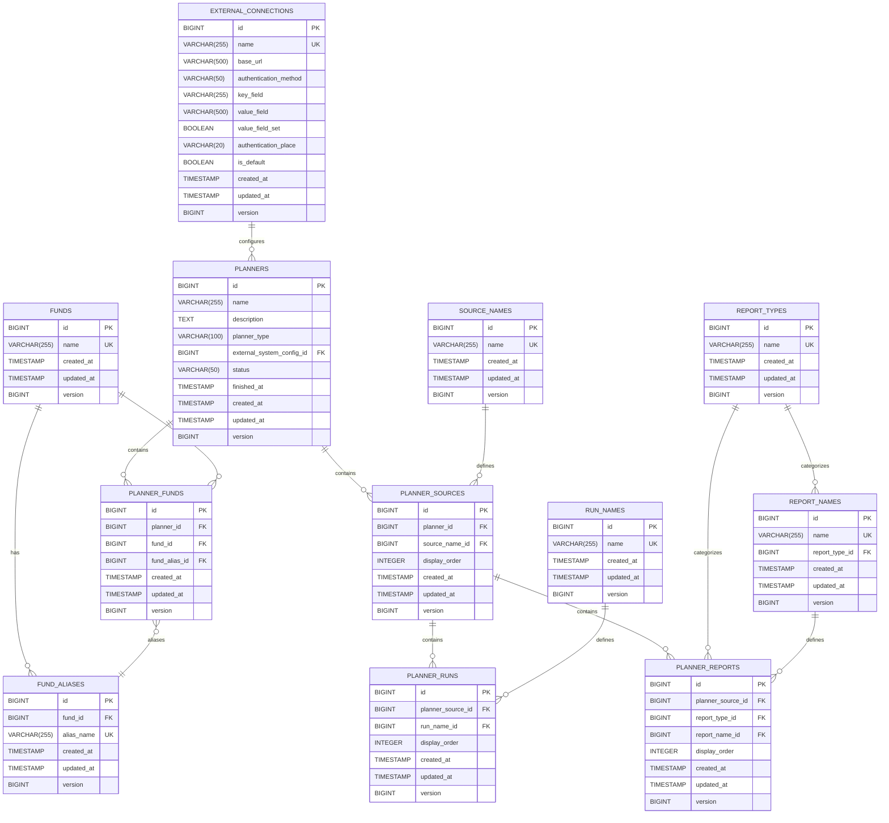

# Database Schema Documentation

## Overview

The SwissPine Connection Planner application uses **PostgreSQL** as its relational database, managed through **Spring Data JPA** with Hibernate as the ORM provider. This document provides comprehensive documentation of the database schema, constraints, indexes, and Java-to-database mappings.

**Database**: PostgreSQL 14+  
**ORM**: Hibernate 6.x (via Spring Data JPA)  
**Migration Strategy**: JPA Auto-DDL (controlled by `spring.jpa.hibernate.ddl-auto`)

---

## Entity Relationship Diagram



---

## Table Specifications

### BaseEntity (Abstract)

All entities inherit these common fields via `@MappedSuperclass`:

| Column | Type | Constraints | Description |
|--------|------|-------------|-------------|
| `id` | `BIGINT` | PRIMARY KEY, AUTO_INCREMENT | Unique identifier using IDENTITY strategy |
| `created_at` | `TIMESTAMP` | NOT NULL, IMMUTABLE | Auto-populated on creation via `@CreatedDate` |
| `updated_at` | `TIMESTAMP` | NOT NULL | Auto-updated on modification via `@LastModifiedDate` |
| `version` | `BIGINT` | NULL | Optimistic locking version number via `@Version` |

**JPA Mapping:**
```java
@MappedSuperclass
@EntityListeners(AuditingEntityListener.class)
public abstract class BaseEntity {
    @Id
    @GeneratedValue(strategy = GenerationType.IDENTITY)
    private Long id;
    
    @CreatedDate
    @Column(name = "created_at", nullable = false, updatable = false)
    private Instant createdAt;
    
    @LastModifiedDate
    @Column(name = "updated_at", nullable = false)
    private Instant updatedAt;
    
    @Version
    private Long version;
}
```

---

### 1. external_connections

Stores external API connection configurations.

| Column | Type | Constraints | JPA Annotation | Description |
|--------|------|-------------|----------------|-------------|
| `name` | `VARCHAR(255)` | NOT NULL, UNIQUE | `@Column(nullable=false, unique=true)` | Connection display name |
| `base_url` | `VARCHAR(500)` | NOT NULL | `@Column(length=500)` | API base URL |
| `authentication_method` | `VARCHAR(50)` | NOT NULL | `@Column(length=50)` | Auth type (API Key, Bearer, OAuth, etc.) |
| `key_field` | `VARCHAR(255)` | NOT NULL | `@Column(nullable=false)` | HTTP header or query param name |
| `value_field` | `VARCHAR(500)` | NULL | `@Column(length=500)` | Sensitive auth value (masked in responses) |
| `value_field_set` | `BOOLEAN` | NOT NULL, DEFAULT FALSE | `@Column(nullable=false)` | Tracks if value has been set (immutability flag) |
| `authentication_place` | `VARCHAR(20)` | NULL | `@Pattern(regexp="Header|QueryParameters")` | Where to place auth credentials |
| `is_default` | `BOOLEAN` | NOT NULL, DEFAULT FALSE | `@Column(nullable=false)` | Default connection indicator |

**Indexes:**
- `idx_ext_conn_name` ON `(name)` - Fast lookup by name
- `idx_ext_conn_default` ON `(is_default)` - Optimize default connection queries

**Unique Constraints:**
- `uk_ext_conn_name` ON `(name)` - Enforce unique connection names

**Validation:**
```java
@NotBlank(message = "Connection name is required")
@Size(max = 255)
private String name;

@Pattern(regexp = "Header|QueryParameters")
private String authenticationPlace;
```

**Lifecycle Hooks:**
```java
@PrePersist
@PreUpdate
private void setValueFieldFlag() {
    if (valueField != null && !valueFieldSet) {
        valueFieldSet = true;
    }
}
```

---

### 2. planners

Main planning entity containing configuration and status.

| Column | Type | Constraints | JPA Annotation | Description |
|--------|------|-------------|----------------|-------------|
| `name` | `VARCHAR(255)` | NOT NULL | `@Column(nullable=false)` | Planner display name |
| `description` | `TEXT` | NULL | `@Column(columnDefinition="TEXT")` | Optional detailed description |
| `planner_type` | `VARCHAR(100)` | NULL | `@Column(length=100)` | Type classification (Standard, Custom, Template) |
| `external_system_config_id` | `BIGINT` | NULL, FK | `@ManyToOne(fetch=LAZY)` | Reference to external connection |
| `status` | `VARCHAR(50)` | NOT NULL, DEFAULT 'Draft' | `@Column(length=50)` | Execution status (Draft, In Progress, Finished, Failed) |
| `finished_at` | `TIMESTAMP` | NULL | `@Column` | Auto-set when status becomes "Finished" |

**Indexes:**
- `idx_planner_name` ON `(name)` - Fast lookup by name
- `idx_planner_status` ON `(status)` - Filter by status
- `idx_planner_created` ON `(created_at)` - Time-based queries

**Foreign Keys:**
- `fk_planner_ext_conn` → `external_connections(id)` ON DELETE SET NULL

**Relationships:**
```java
@ManyToOne(fetch = FetchType.LAZY)
@JoinColumn(name = "external_system_config_id", 
            foreignKey = @ForeignKey(name = "fk_planner_ext_conn"))
private ExternalConnection externalSystemConfig;

@OneToMany(mappedBy = "planner", cascade = ALL, orphanRemoval = true)
private List<PlannerFund> funds;

@OneToMany(mappedBy = "planner", cascade = ALL, orphanRemoval = true)
@OrderBy("displayOrder ASC")
private List<PlannerSource> sources;
```

**Lifecycle Hooks:**
```java
@PreUpdate
private void onUpdate() {
    if ("Finished".equalsIgnoreCase(status) && finishedAt == null) {
        finishedAt = Instant.now();
    }
}
```

---

### 3. planner_funds

Junction table linking planners to funds with optional aliases.

| Column | Type | Constraints | JPA Annotation | Description |
|--------|------|-------------|----------------|-------------|
| `planner_id` | `BIGINT` | NOT NULL, FK | `@ManyToOne(optional=false)` | Parent planner |
| `fund_id` | `BIGINT` | NOT NULL, FK | `@ManyToOne(optional=false)` | Associated fund |
| `fund_alias_id` | `BIGINT` | NULL, FK | `@ManyToOne` | Optional fund alias |

**Indexes:**
- `idx_planner_funds_planner` ON `(planner_id)` - Join optimization
- `idx_planner_funds_fund` ON `(fund_id)` - Reverse lookup

**Unique Constraints:**
- `uk_planner_fund` ON `(planner_id, fund_id)` - Prevent duplicate fund entries per planner

**Foreign Keys:**
- `fk_planner_fund_planner` → `planners(id)` ON DELETE CASCADE
- `fk_planner_fund_fund` → `funds(id)` ON DELETE RESTRICT
- `fk_planner_fund_alias` → `fund_aliases(id)` ON DELETE SET NULL

---

### 4. planner_sources

Data source configurations for planners.

| Column | Type | Constraints | JPA Annotation | Description |
|--------|------|-------------|----------------|-------------|
| `planner_id` | `BIGINT` | NOT NULL, FK | `@ManyToOne(optional=false)` | Parent planner |
| `source_name_id` | `BIGINT` | NULL, FK | `@ManyToOne` | Source identifier |
| `display_order` | `INTEGER` | NOT NULL, DEFAULT 0 | `@Column(nullable=false)` | UI display order |

**Indexes:**
- `idx_planner_sources_planner` ON `(planner_id)` - Parent lookup
- `idx_planner_sources_order` ON `(planner_id, display_order)` - Ordered retrieval

**Foreign Keys:**
- `fk_planner_source_planner` → `planners(id)` ON DELETE CASCADE
- `fk_planner_source_name` → `source_names(id)` ON DELETE SET NULL

**Relationships:**
```java
@OneToMany(mappedBy = "plannerSource", cascade = ALL, orphanRemoval = true)
@OrderBy("displayOrder ASC")
private List<PlannerRun> runs;

@OneToMany(mappedBy = "plannerSource", cascade = ALL, orphanRemoval = true)
@OrderBy("displayOrder ASC")
private List<PlannerReport> reports;
```

---

### 5. funds

Master data table for fund names.

| Column | Type | Constraints | JPA Annotation | Description |
|--------|------|-------------|----------------|-------------|
| `name` | `VARCHAR(255)` | NOT NULL, UNIQUE | `@Column(nullable=false, unique=true)` | Fund name |

**Indexes:**
- `idx_funds_name` ON `(name)` - Fast name lookup

**Unique Constraints:**
- `uk_fund_name` ON `(name)` - Enforce unique fund names

**Relationships:**
```java
@OneToMany(mappedBy = "fund", cascade = ALL, orphanRemoval = true)
private List<FundAlias> aliases;
```

---

### 6. fund_aliases

Alternative names for funds (0-to-many relationship).

| Column | Type | Constraints | JPA Annotation | Description |
|--------|------|-------------|----------------|-------------|
| `fund_id` | `BIGINT` | NOT NULL, FK | `@ManyToOne(optional=false)` | Parent fund |
| `alias_name` | `VARCHAR(255)` | NOT NULL, UNIQUE | `@Column(unique=true)` | Alias display name |

**Indexes:**
- `idx_fund_aliases_fund` ON `(fund_id)` - Parent lookup
- `idx_fund_aliases_name` ON `(alias_name)` - Name search

**Unique Constraints:**
- `uk_fund_alias_name` ON `(alias_name)` - Global unique aliases

**Foreign Keys:**
- `fk_fund_alias_fund` → `funds(id)` ON DELETE CASCADE

---

### 7. source_names (Master Data)

| Column | Type | Constraints | Description |
|--------|------|-------------|-------------|
| `name` | `VARCHAR(255)` | NOT NULL, UNIQUE | Source identifier |

**Indexes:** `idx_source_names_name` ON `(name)`  
**Unique Constraints:** `uk_source_name` ON `(name)`

---

### 8. run_names (Master Data)

| Column | Type | Constraints | Description |
|--------|------|-------------|-------------|
| `name` | `VARCHAR(255)` | NOT NULL, UNIQUE | Run configuration name |

**Indexes:** `idx_run_names_name` ON `(name)`  
**Unique Constraints:** `uk_run_name` ON `(name)`

---

### 9. report_types (Master Data)

| Column | Type | Constraints | Description |
|--------|------|-------------|-------------|
| `name` | `VARCHAR(255)` | NOT NULL, UNIQUE | Report category |

**Indexes:** `idx_report_types_name` ON `(name)`  
**Unique Constraints:** `uk_report_type_name` ON `(name)`

---

### 10. report_names (Master Data)

| Column | Type | Constraints | JPA Annotation | Description |
|--------|------|-------------|----------------|-------------|
| `name` | `VARCHAR(255)` | NOT NULL, UNIQUE | `@Column(unique=true)` | Report name |
| `report_type_id` | `BIGINT` | NULL, FK | `@ManyToOne` | Associated report type |

**Indexes:** `idx_report_names_name` ON `(name)`  
**Unique Constraints:** `uk_report_name` ON `(name)`  
**Foreign Keys:** `fk_report_name_type` → `report_types(id)` ON DELETE SET NULL

---

### 11. planner_runs

Links planner sources to run configurations.

| Column | Type | Constraints | JPA Annotation | Description |
|--------|------|-------------|----------------|-------------|
| `planner_source_id` | `BIGINT` | NOT NULL, FK | `@ManyToOne(optional=false)` | Parent source |
| `run_name_id` | `BIGINT` | NULL, FK | `@ManyToOne` | Run configuration |
| `display_order` | `INTEGER` | NOT NULL | `@Column(nullable=false)` | Display order |

**Indexes:** `idx_planner_runs_source` ON `(planner_source_id)`  
**Foreign Keys:**
- `fk_planner_run_source` → `planner_sources(id)` ON DELETE CASCADE
- `fk_planner_run_name` → `run_names(id)` ON DELETE SET NULL

---

### 12. planner_reports

Links planner sources to report configurations.

| Column | Type | Constraints | JPA Annotation | Description |
|--------|------|-------------|----------------|-------------|
| `planner_source_id` | `BIGINT` | NOT NULL, FK | `@ManyToOne(optional=false)` | Parent source |
| `report_type_id` | `BIGINT` | NULL, FK | `@ManyToOne` | Report type |
| `report_name_id` | `BIGINT` | NULL, FK | `@ManyToOne` | Report name |
| `display_order` | `INTEGER` | NOT NULL | `@Column(nullable=false)` | Display order |

**Indexes:** `idx_planner_reports_source` ON `(planner_source_id)`  
**Foreign Keys:**
- `fk_planner_report_source` → `planner_sources(id)` ON DELETE CASCADE
- `fk_planner_report_type` → `report_types(id)` ON DELETE SET NULL
- `fk_planner_report_name` → `report_names(id)` ON DELETE SET NULL

---

## Data Type Mappings

### PostgreSQL ↔ Java Type Mappings

| PostgreSQL Type | Java Type | JPA Annotation | Notes |
|----------------|-----------|----------------|-------|
| `BIGINT` | `Long` | `@Id`, `@GeneratedValue` | Primary keys and FKs |
| `VARCHAR(n)` | `String` | `@Column(length=n)` | Text fields with length limits |
| `TEXT` | `String` | `@Column(columnDefinition="TEXT")` | Unlimited text |
| `BOOLEAN` | `Boolean` | `@Column` | True/false flags |
| `INTEGER` | `Integer` | `@Column` | Display order fields |
| `TIMESTAMP` | `java.time.Instant` | `@Column` | UTC timestamps |

### Enum-like Fields

Status and type fields use `VARCHAR` with validation:

```java
@Pattern(regexp = "Draft|In Progress|Finished|Failed")
private String status;

@Pattern(regexp = "Header|QueryParameters")
private String authenticationPlace;
```

---

## Constraints Summary

### Primary Keys
All tables use `BIGINT` auto-increment via `GenerationType.IDENTITY`

### Foreign Keys with Cascade Rules

| Table | FK Column | References | ON DELETE |
|-------|-----------|-----------|-----------|
| `planners` | `external_system_config_id` | `external_connections(id)` | SET NULL |
| `planner_funds` | `planner_id` | `planners(id)` | CASCADE |
| `planner_funds` | `fund_id` | `funds(id)` | RESTRICT |
| `planner_funds` | `fund_alias_id` | `fund_aliases(id)` | SET NULL |
| `planner_sources` | `planner_id` | `planners(id)` | CASCADE |
| `planner_sources` | `source_name_id` | `source_names(id)` | SET NULL |
| `planner_runs` | `planner_source_id` | `planner_sources(id)` | CASCADE |
| `planner_runs` | `run_name_id` | `run_names(id)` | SET NULL |
| `planner_reports` | `planner_source_id` | `planner_sources(id)` | CASCADE |
| `planner_reports` | `report_type_id` | `report_types(id)` | SET NULL |
| `planner_reports` | `report_name_id` | `report_names(id)` | SET NULL |
| `fund_aliases` | `fund_id` | `funds(id)` | CASCADE |
| `report_names` | `report_type_id` | `report_types(id)` | SET NULL |

### Unique Constraints

| Table | Columns | Constraint Name | Purpose |
|-------|---------|-----------------|---------|
| `external_connections` | `name` | `uk_ext_conn_name` | Unique connection names |
| `planner_funds` | `planner_id, fund_id` | `uk_planner_fund` | No duplicate funds per planner |
| `funds` | `name` | `uk_fund_name` | Unique fund names |
| `fund_aliases` | `alias_name` | `uk_fund_alias_name` | Globally unique aliases |
| `source_names` | `name` | `uk_source_name` | Unique source names |
| `run_names` | `name` | `uk_run_name` | Unique run names |
| `report_types` | `name` | `uk_report_type_name` | Unique type names |
| `report_names` | `name` | `uk_report_name` | Unique report names |

---

## Index Strategy

### Performance Indexes

**Lookup Indexes:**
- All `name` columns indexed for fast searches
- Foreign keys automatically indexed by most databases

**Composite Indexes:**
- `idx_planner_sources_order (planner_id, display_order)` - Optimizes ordered retrieval
- Standard single-column indexes on all FK columns

**Filtering Indexes:**
- `idx_planner_status` - Enable fast status filtering
- `idx_ext_conn_default` - Quick default connection lookup
- `idx_planner_created` - Time-range queries

### Index Annotations

```java
@Table(indexes = {
    @Index(name = "idx_planner_name", columnList = "name"),
    @Index(name = "idx_planner_status", columnList = "status")
})
```

---

## JPA Relationship Mappings

### @ManyToOne (Foreign Key Owner)

```java
@ManyToOne(fetch = FetchType.LAZY, optional = false)
@JoinColumn(
    name = "planner_id", 
    nullable = false,
    foreignKey = @ForeignKey(name = "fk_planner_fund_planner")
)
private Planner planner;
```

**Key Points:**
- `fetch = LAZY` - Delays loading until accessed (performance)
- `optional = false` - Maps to `nullable = false`
- `foreignKey` - Names the FK constraint

### @OneToMany (Inverse Side)

```java
@OneToMany(
    mappedBy = "planner", 
    cascade = CascadeType.ALL, 
    orphanRemoval = true,
    fetch = FetchType.LAZY
)
private List<PlannerFund> funds;
```

**Key Points:**
- `mappedBy` - Specifies the owning field
- `cascade = ALL` - Propagate all operations
- `orphanRemoval = true` - Delete orphans on removal
- `@OrderBy` - SQL ORDER BY clause

### Bidirectional Helper Methods

```java
public void addFund(PlannerFund fund) {
    funds.add(fund);
    fund.setPlanner(this);  // Maintain both sides
}

public void removeFund(PlannerFund fund) {
    funds.remove(fund);
    fund.setPlanner(null);  // Break relationship
}
```

---

## Auditing & Versioning

### Automatic Timestamps

Enabled via `@EnableJpaAuditing` in Spring Boot config:

```java
@CreatedDate
@Column(updatable = false)
private Instant createdAt;  // Set once on INSERT

@LastModifiedDate
private Instant updatedAt;  // Updated on every UPDATE
```

### Optimistic Locking

```java
@Version
private Long version;  // Auto-incremented on UPDATE

// Prevents lost updates - throws OptimisticLockException
// if version doesn't match during UPDATE
```

---

## Validation Constraints

### Bean Validation (JSR-380)

Applied at entity level, enforced before persistence:

```java
@NotBlank(message = "Name is required")
@Size(max = 255, message = "Name too long")
private String name;

@Pattern(regexp = "^https?://.*", message = "Invalid URL")
private String baseUrl;
```

### Database Constraints

- `NOT NULL` - Mapped from `@Column(nullable = false)`
- `UNIQUE` - Mapped from `@Column(unique = true)` or `@UniqueConstraint`
- `CHECK` - Requires raw SQL via `@Check` (not used in current schema)

---

## Performance Optimization

### Query Optimization

1. **Lazy Loading** - All relationships use `FetchType.LAZY`
2. **Indexed Lookups** - All filter fields indexed
3. **Composite Keys** - Junction tables use composite unique constraints
4. **Pagination** - Spring Data `Pageable` support built-in

### N+1 Prevention

Use `@EntityGraph` or JOIN FETCH for collections:

```java
@Query("SELECT p FROM Planner p LEFT JOIN FETCH p.funds WHERE p.id = :id")
Planner findByIdWithFunds(@Param("id") Long id);
```

### Batch Operations

Hibernate batch size configuration:

```properties
spring.jpa.properties.hibernate.jdbc.batch_size=20
spring.jpa.properties.hibernate.order_inserts=true
spring.jpa.properties.hibernate.order_updates=true
```

---

## Migration Strategy

### Current Approach: Auto-DDL

```properties
spring.jpa.hibernate.ddl-auto=update
```

**Development:** `update` - Auto-create/update schema  
**Production:** `validate` - Only validate, no changes

### Recommended: Flyway/Liquibase

For production, use version-controlled migrations:

```sql
-- V1__initial_schema.sql
CREATE TABLE external_connections (
    id BIGSERIAL PRIMARY KEY,
    name VARCHAR(255) UNIQUE NOT NULL,
    -- ...
);

CREATE INDEX idx_ext_conn_name ON external_connections(name);
```

---

## Summary

This database schema provides:

✅ **12 normalized tables** with clear separation of concerns  
✅ **Referential integrity** via foreign keys with appropriate cascade rules  
✅ **Performance indexes** on all searchable and joinable columns  
✅ **Audit trail** with automatic timestamps and versioning  
✅ **Type safety** through Java enums and validation annotations  
✅ **Scalability** via lazy loading and composite indexes  

**Total Tables:** 12  
**Total Indexes:** 24+  
**Total Relationships:** 15 foreign keys  
**Total Unique Constraints:** 10
