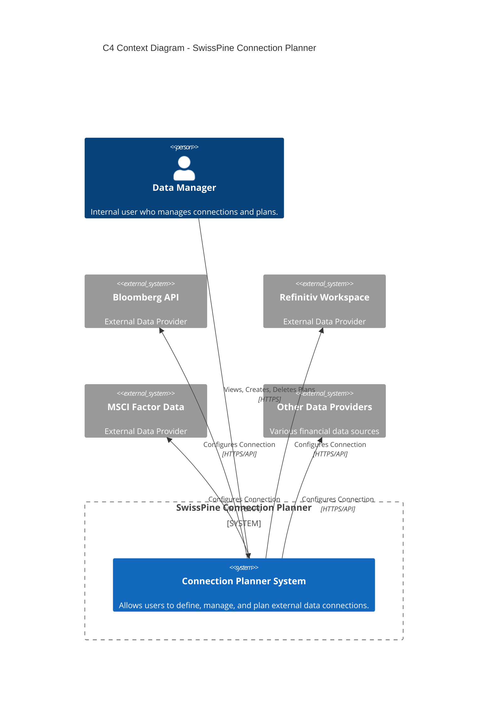
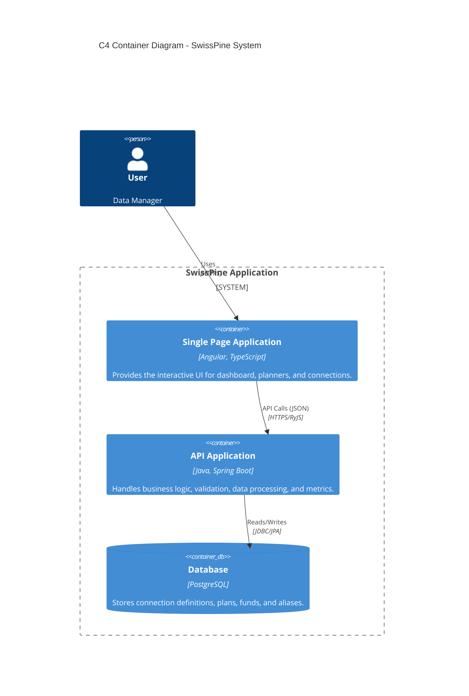
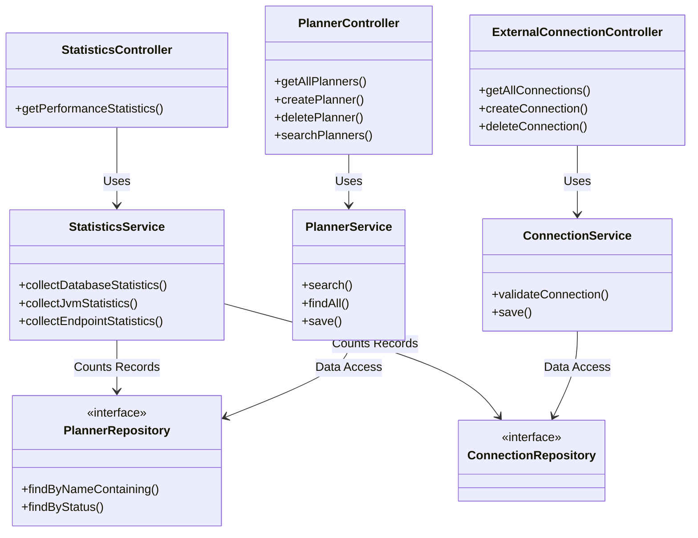
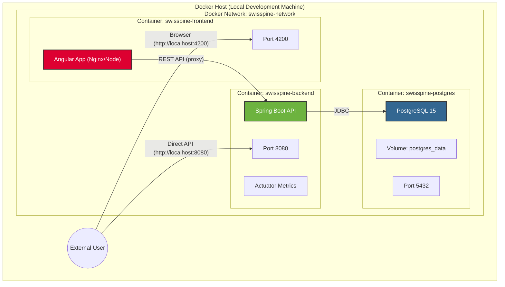
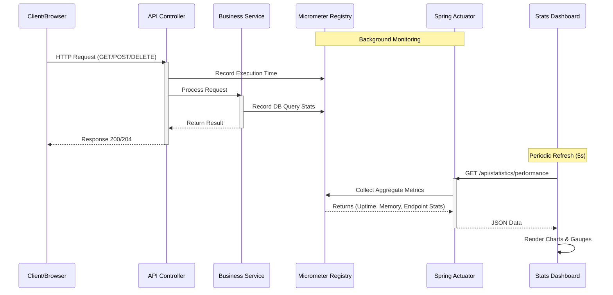

# System Architecture & Technology Stack
## SwissPine Connection Planner

This document provides a comprehensive overview of the technical architecture, technology stack, and component design of the SwissPine Connection Planner application.

## 1. Technology Stack

### Frontend (User Interface)
| Category | Technology | Version | Purpose |
|----------|------------|---------|---------|
| **Framework** | **Angular** | v17.x | Robust, component-based SPA framework |
| **UI Library** | **Angular Material** | v17.x | Material Design components for consistent UX |
| **State Mgt** | **RxJS** | v7.8.0 | Reactive extensions for asynchronous data handling |
| **Styling** | **CSS3** | - | Custom responsive grid layouts and theming |
| **Build Tool** | **Angular CLI** | - | Development server, build optimization, and testing |

### Backend (API & Business Logic)
| Category | Technology | Version | Purpose |
|----------|------------|---------|---------|
| **Language** | **Java** | 17 (LTS) | Robust, typed, object-oriented language |
| **Framework** | **Spring Boot** | 3.2.2 | Rapid application development, DI, and auto-config |
| **ORM** | **Spring Data JPA** | - | Abstraction over Hibernate for database interactions |
| **Validation** | **Hibernate Validator** | - | Bean validation for data integrity |
| **Monitoring** | **Actuator & Micrometer**| - | Health checks, metrics, and Prometheus integration |
| **Build Tool** | **Maven** | - | Dependency management and build lifecycle |

### Data & Infrastructure
| Category | Technology | Version | Purpose |
|----------|------------|---------|---------|
| **Database** | **PostgreSQL** | 15 (Alpine)| Reliable, ACID-compliant relational database |
| **Pooling** | **HikariCP** | - | High-performance JDBC connection pooling |
| **Container** | **Docker** | - | Application containerization for consistency |
| **Orchestrator**| **Docker Compose** | v3.8 | Multi-container environment definition |

---

## 2. High-Level Architecture (C4 Context)

This diagram shows the system in the context of its users and external dependencies.

---

## 3. Container Architecture (C4 Container)

This view zooms in to show the independently deployable containers (Web App, API, Database) and their interactions.

---

## 4. Component Design (Backend)

Detailed view of the Spring Boot application structure, highlighting the separation of concerns.

---

## 5. Deployment Infrastructure

Visualizing how the application is deployed using Docker Compose.

## 6. Performance Monitoring Architecture

Since performance is a key KPI, here is the flow of metrics in the system.

